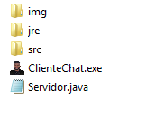
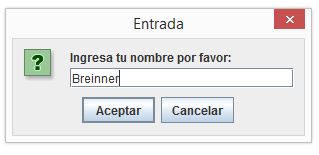
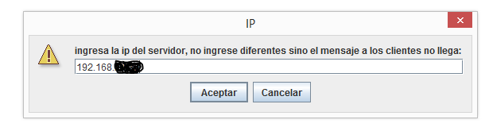
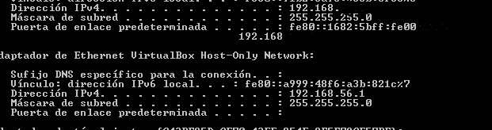
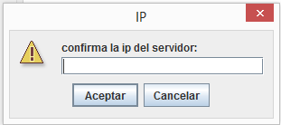
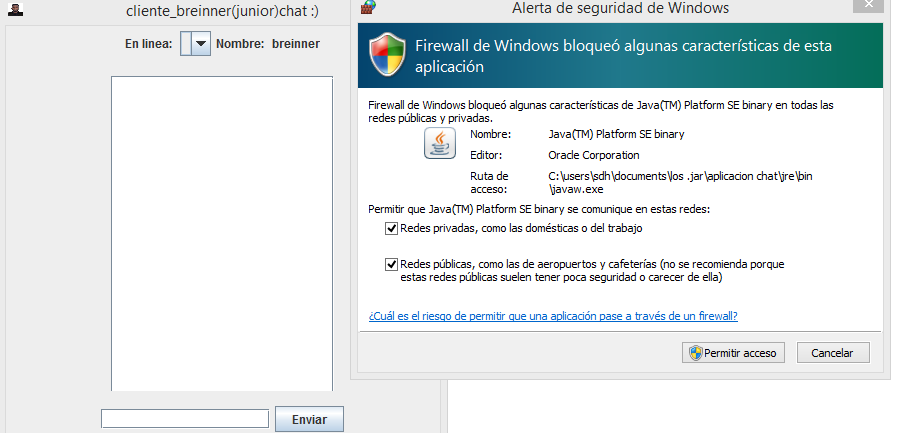
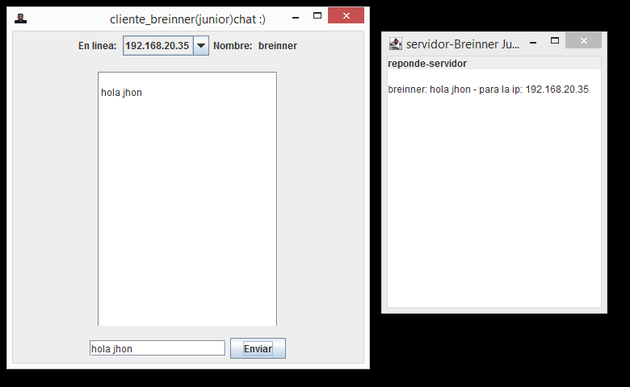
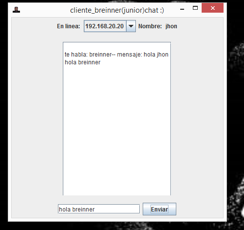

# AplicacionChat 💻
## **Utilizar en Windows**
### 1) utiliza el  ` servidor.java `   de la carpeta en un IDE de tu gusto como **Eclipse**, **Netbens** y ejecutas 
###  el codigo fuente.
### *para que funcione bien  los clientes y el servidor deben estar ejecutandose en una red LAN.* 

### 2) cuando el servidor este ejecutando puedes utlizar   ` ClienteChat.exe ` en computadores de la red, primer mensaje:

___
### 3) el egundo mensaje te pide ip del servidor esta ip es del PC donde se Ejecuta  ` servidor.java ` 

___

   ###  **si necesitas la ip escribe en el cmd de windows   ` ipconfig ` donde dice  Direccion IPv4  esa es la ip del servior**
   ###  **EJEMPLO**

       

### 4) confirmar ip 

 

### 5) si te pide permisos de red aceptalos es para poder conectar al servidor

### 6)  escoge ipcliente para chatear 

### 7)  el  ` ClienteChat.exe ` de otro pc responde 

